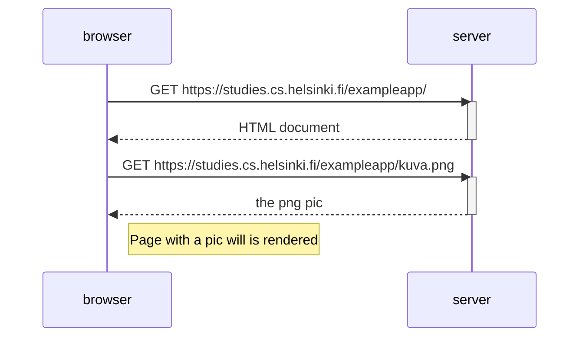

# fly-test

## kuva 1

```mermaid
sequenceDiagram
    participant browser
    participant server
    browser->>server: GET https://studies.cs.helsinki.fi/exampleapp/
    activate server
    server-->>browser: HTML document
    deactivate server
    browser->>server: GET https://studies.cs.helsinki.fi/exampleapp/kuva.png
    activate server
    server-->>browser: the png pic
    deactivate server
    Note right of browser: Page with a pic will is rendered
```
